```{=html}
<iframe src="people_network.html" width="100%" height="600px" style="border:none;"></iframe>
```


::: {.panel-tabset}

## By Institution

# SUNY Buffalo

[{width=40% fig-align="left"}](https://publichealth.buffalo.edu/epidemiology-and-environmental-health)

{fig-align="left" width=15%} Kelly Baker (Principal Investigator)

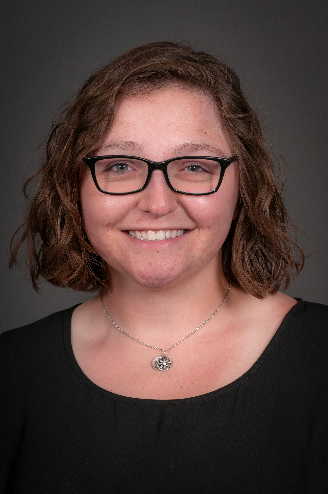{fig-align="left" width=15%} Ellie Madson (Laboratory Manager & Project Coordinator)


# University of Iowa

<!-- [](https://uiowa.edu/) -->
<!-- [](https://uiowa.edu/) -->
<!-- [](https://uiowa.edu/) -->
[{width=40% fig-align="left"}](https://www.public-health.uiowa.edu/biostat/)
<!-- [](https://uiowa.edu/) -->
<!-- [](https://uiowa.edu/) -->
<!-- [](https://uiowa.edu/) -->
<!-- [](https://uiowa.edu/) -->
<!-- [](https://uiowa.edu/) -->


{fig-align="left" width=15%} Sabin Gaire (Graduate Research Assistant)


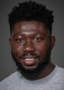{fig-align="left" width=15%} Daniel Kakou (Graduate Research Assistant)


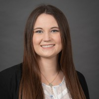{fig-align="left" width=15%} Alexis Kapanka (Laboratory Manager)


<!-- {fig-align="left" width=15%} --> John Kessler (Graduate Research Assistant)

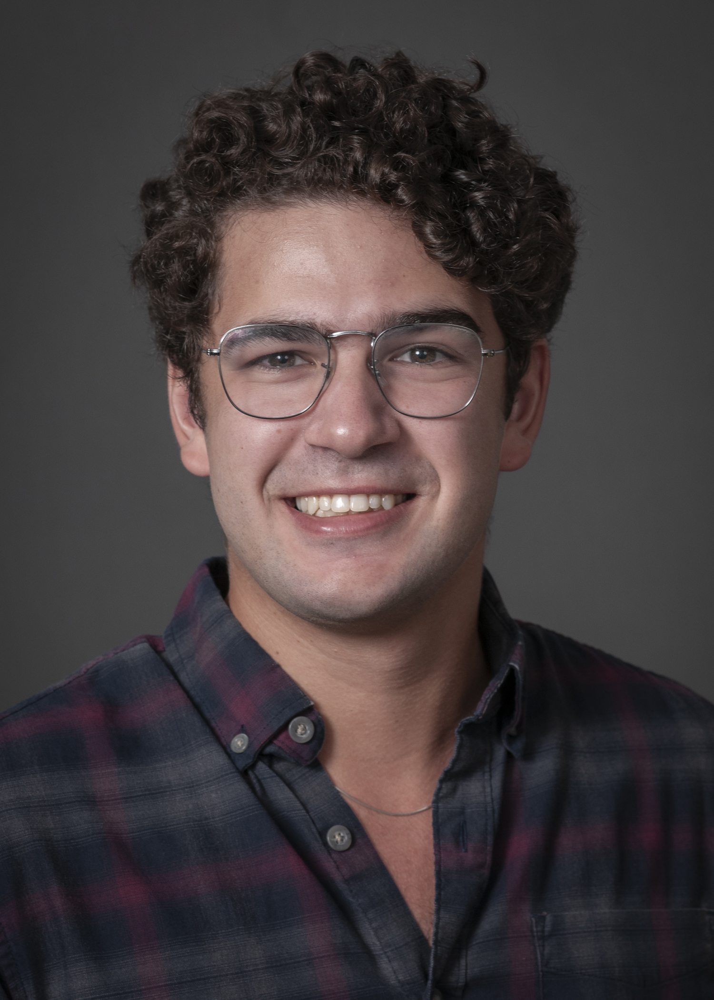{fig-align="left" width=15%} Mark Krysan (Graduate Research Assistant)

{fig-align="left" width=15%} Tan Nguyen (Graduate Research Assistant)


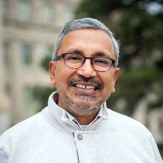{fig-align="left" width=15%} Sriram Pemmaraju (Co-investigator)

{fig-align="left" width=15%} Daniel Sewell (Principal Investigator)

{fig-align="left" width=15%} Luis Torres (Graduate Research Assistant)

{fig-align="left" width=15%} Gabriele Villarini (Co-investigator)


# African Population and Health Research Center

[{width=40% fig-align="left"}](https://aphrc.org/)

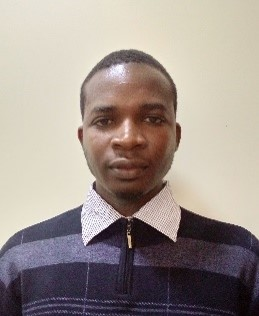{fig-align="left" width=15%} John Agira (Laboratory Assistant)

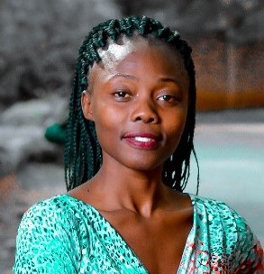{fig-align="left" width=15%} Christine Amondi (Laboratory Assistant)

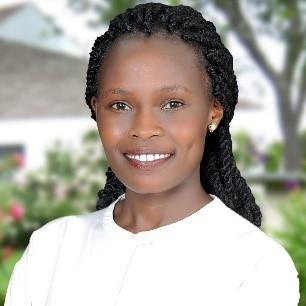{fig-align="left" width=15%} Phylis Busienei (Study Coordinator)

{fig-align="left" width=15%} Blessing Mberu (Co-investigator)

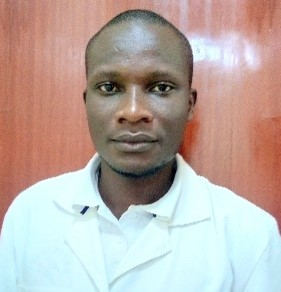{fig-align="left" width=15%} Bonphace Okoth (Laboratory Assistant)

{fig-align="left" width=15%} Sheillah Simiyu (Co-investigator)

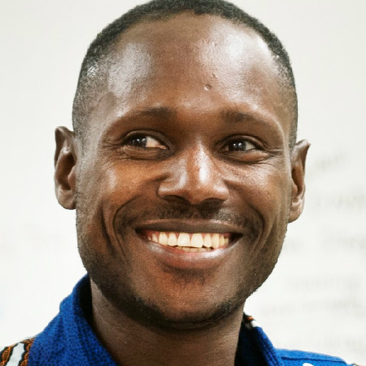{fig-align="left" width=15%} Innocent Tumwebaze (Project Manager)

{fig-align="left" width=15%} Abdhalah Ziraba (Co-investigator)


# Maseno University

[{fig-align="left" width=40%}](https://www.maseno.ac.ke/)


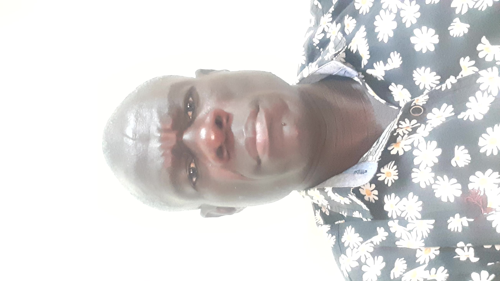{fig-align="left width=15%} Jairus Abuom (Laboratory Assistant)

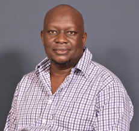{fig-align="left" width=15%} Collins Ouma (Co-investigator)

{fig-align="left" width=15%} Marsha Sharon (Laboratory Assistant)


# University of Memphis
[{fig-align="left" width=40%}](https://www.memphis.edu/)


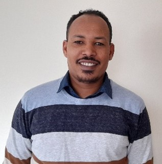{fig-align="left" width=15%} Fanta Gutema (Co-investigator)


# Affiliates

{fig-align="left" width=15%} Abisola Osinuga (Co-investigator, University of North Carolina)


## By domain

# Microbiology and Epidemiology

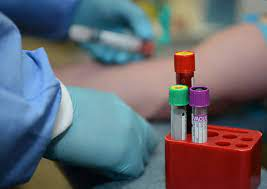{fig-align="left" width=40%}

{fig-align="left width=15%} Jairus Abuom (Laboratory Assistant)


{fig-align="left" width=15%} John Agira (Laboratory Assistant)

{fig-align="left" width=15%} Christine Amondi (Laboratory Assistant)

{fig-align="left" width=15%} Kelly Baker (Principal Investigator)

{fig-align="left" width=15%} Fanta Gutema (Post-doctoral Fellow)

{fig-align="left" width=15%} Alexis Kapanka (Laboratory Manager)


{fig-align="left" width=15%} Ellie Madson (Laboratory Manager & Project Coordinator)


{fig-align="left" width=15%} Bonphace Okoth (Laboratory Assistant)

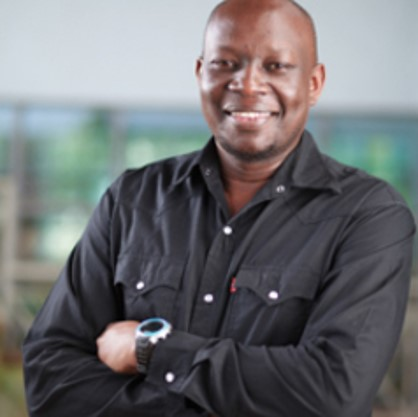{fig-align="left" width=15%} Collins Ouma (Co-investigator)

{fig-align="left" width=15%} Marsha Sharon (Laboratory Assistant)


{fig-align="left" width=15%} Abdhalah Ziraba (Co-investigator)


# Statistics and Computer Science

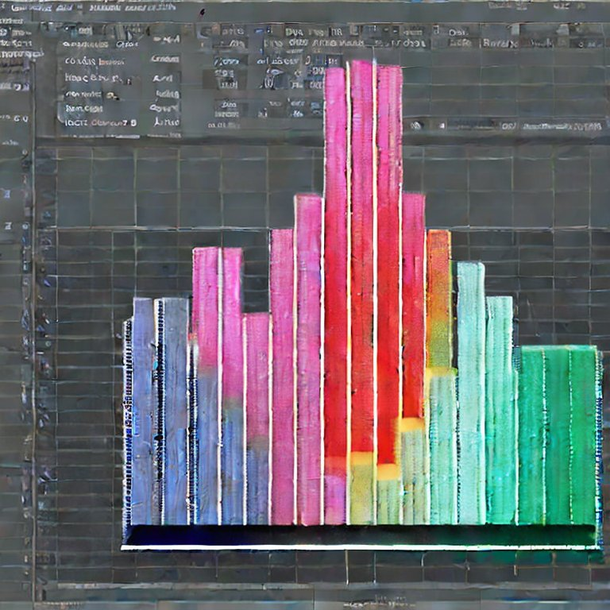{fig-align="left" width=40%}

{fig-align="left" width=15%} Sabin Gaire (Graduate Research Assistant)

{fig-align="left" width=15%} Daniel Kakou (Graduate Research Assistant)


<!-- {fig-align="left" width=15%} --> John Kessler (Graduate Research Assistant)


{fig-align="left" width=15%} Mark Krysan (Graduate Research Assistant)


{fig-align="left" width=15%} Tan Nguyen (Graduate Research Assistant)


{fig-align="left" width=15%} Sriram Pemmaraju (Co-investigator)

{fig-align="left" width=15%} Daniel Sewell (Principal Investigator)


# Community and Behavioral Science

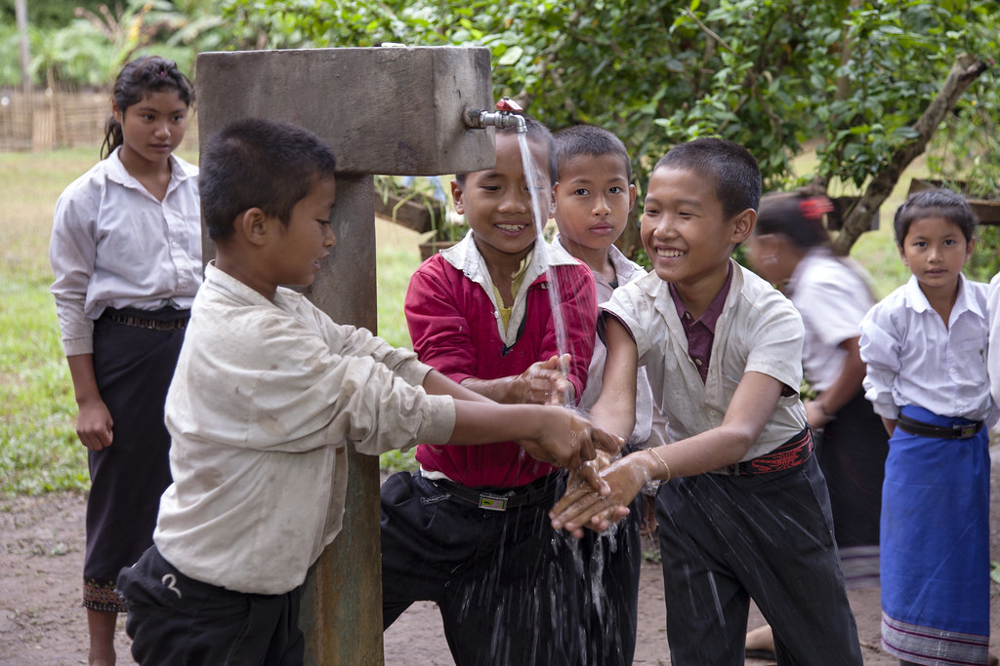{fig-align="left" width=40%}

{fig-align="left" width=15%} Phylis Busienei (Study Coordinator)

{fig-align="left" width=15%} Abisola Osinuga (Co-investigator)


{fig-align="left" width=15%} Sheillah Simiyu (Co-investigator)

{fig-align="left" width=15%} Innocent Tumwebaze (Project Manager)


# Demography and Urban Policy

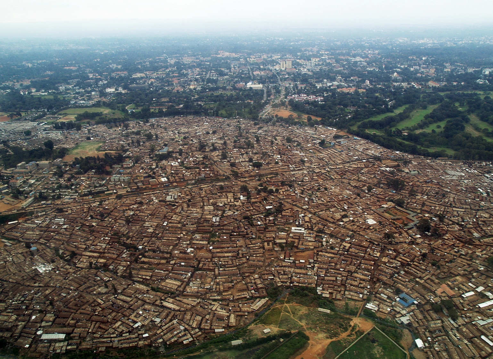{fig-align="left" width=40%}

{fig-align="left" width=15%} Blessing Mberu (Co-investigator)


# Climate Science

{fig-align="left" width=40%}

{fig-align="left" width=15%} Luis Torres (Graduate Research Assistant)

{fig-align="left" width=15%} Gabriele Villarini (Co-investigator)


:::

